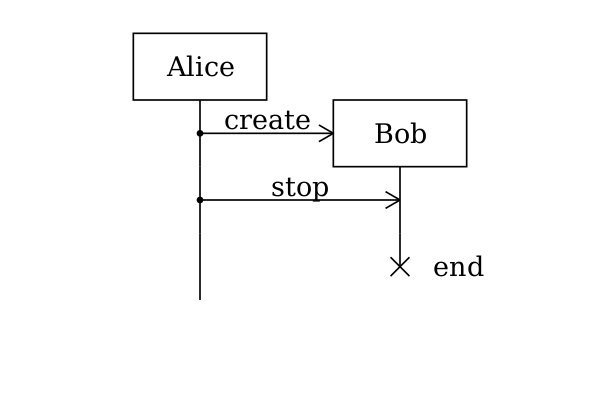
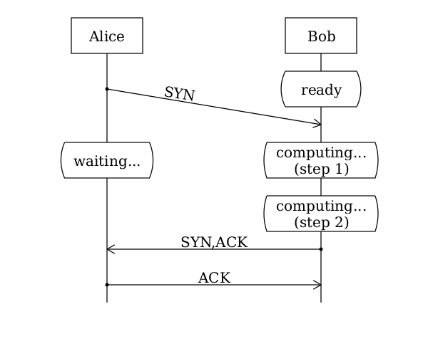
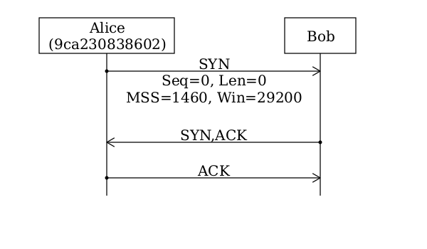
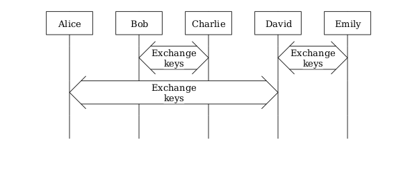
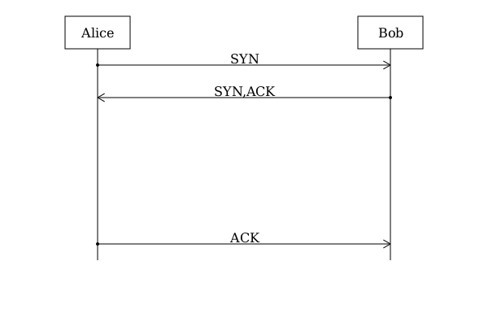
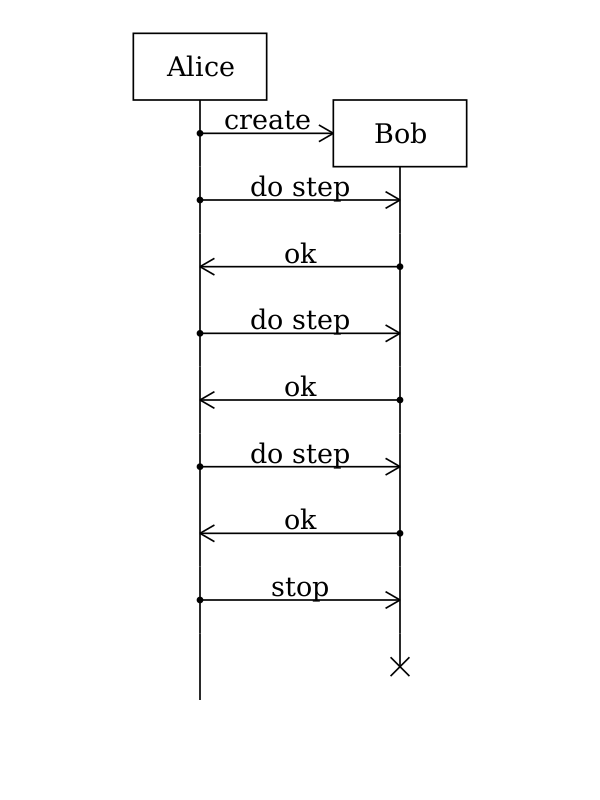

# Meseq Examples
## 01_basic.msq

	
	# This is a comment
	
	[init]
	actor a Alice
	actor b Bob
	
	[scenario]
	a -> b SYN
	a <- b SYN,ACK
	a -> b ACK
	

## 02_create_actor.msq

	[init]
	actor a Alice
	
	[scenario]
	a -* b label=create actor_label=Bob
	a -> b stop
	b + end
	

## 03_box.msq

	[init]
	actor a Alice
	actor b Bob
	
	[scenario]
	a -> b SYN
	:
	:
	b -box computing...
	:
	:
	a <- b SYN,ACK
	a -> b ACK
	

## 04_multilines.msq

	[init]
	actor a Alice\n(9ca230838602)
	actor ""
	actor b Bob
	
	[scenario]
	a -> b "SYN\nSeq=0, Len=0\nMSS=1460, Win=29200"
	a <- b SYN,ACK
	a -> b ACK
	

## 05_double_arrow.msq

	[init]
	actor a Alice
	actor ""
	actor ""
	actor b Bob
	
	[scenario]
	:
	:
	a <-> b Hanshake
	:
	

## 06_message_lost.msq

	[init]
	actor a Alice
	actor ""
	actor ""
	actor b Bob
	
	[scenario]
	a -x b SYN
	a -> b SYN
	

## 07_crossing.msq

	[init]
	actor a Alice
	actor ""
	actor ""
	actor b Bob
	
	[scenario]
	a -> b msg-x goto=L1
	a <- b msg-y goto=L1
	:L1
	:

## 15_layout.msq

	[init]
	actor a Alice
	actor ""
	actor ""
	actor b Bob
	
	[scenario]
	a -> b SYN
	a <- b SYN,ACK
	:
	:
	:
	a -> b ACK
	

## 16_decoration.msq

	[init]
	actor a Alice color=blue
	actor b Bob
	font-family gentium
	font-size 15
	font-style italic
	
	[scenario]
	a -> b SYN color=666 # grey
	a <- b SYN,ACK font-size=2
	a -> b ACK
	b -* c actor_bgcolor=orange actor_label=Charlie
	b -box waiting... bgcolor=yellow
	:
	

## 20_include.msq

	[init]
	actor a Alice
	
	[scenario]
	-include step_init
	-include step_do_transaction
	-include step_do_transaction
	-include step_do_transaction
	
	-include 20_include_1.msqi
	
	[step_init]
	a -* b create actor_label=Bob
	
	[step_do_transaction]
	a -> b "do step"
	a <- b "ok"

