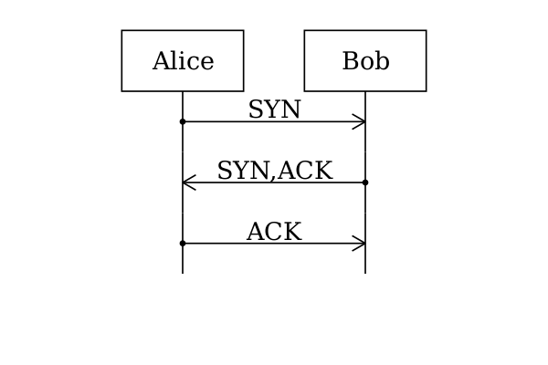

# Meseq Overview

Meseq is a free and open-source generator of message sequence charts.

Inputs:

- a text `msq` file

Example:

    [init]
    actor a Alice
    actor b Bob
    
    [scenario]
    a -> b SYN
    a <- b SYN,ACK
    a -> b ACK

Outputs:

- an image

